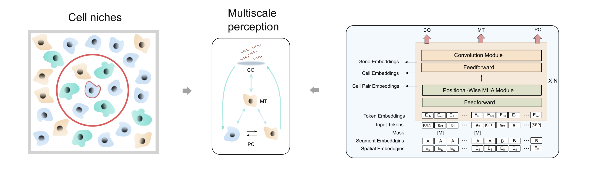

---

This is the official SpatialFormer codebase. SpatialFormer is the first single-cell spatial foundation model that learns universal representations of subcellular molecular and cellular spatial proximity through multi-task learning.

[](https://github.com/username/repo/blob/main/LICENSE)

[](https://pepy.tech/project/spatialformer)




## Overview
Spatial transcriptomics quantifies gene expression within its spatial context, making significant advances in biomedical research possible. Understanding the spatial expression of genes and how multicellular systems are organised is vital for diagnosing diseases and studying biological processes. However, existing models often struggle to effectively integrate gene expression data with cellular spatial information. In this study, we introduce SpatialFormer: a hybrid framework that combines convolutional networks and transformers in order to learn single-cell multi-scale information within a niche context. This includes expression data and the subcellular spatial distribution of genes. Pre-trained on 700 million cell pairs from 17 million spatially resolved single cells across 71 Xenium slides, SpatialFormer merges gene spatial expression profiles with cell niche information via a pairwise training strategy. Our findings demonstrate that SpatialFormer can distil biological signals across various tasks, including single-cell batch correction, cell-type annotation, co-localisation detection and the identification of gene pairs critical to immune cell-cell interactions involved in the regulation of lung fibrosis. These advancements enhance our understanding of cellular dynamics and open up new avenues for applications in biomedical research. 


## Updates
## [2025-12-27]
### 🚀 Data Scale-Up
- Transcripts: **3.3B → 4.5B**
- Cells: **13M → 17M**
- Slides: **61 → 71**
- Gene vocabulary: **1,922 → 6,036**

### 🧠 Model & Training
- Added a new **edge-based dataloader**; [anchor with preselected index](https://huggingface.co/datasets/TerminatorJ/pairs_dataset) with:
  - distance-aware sampling
  - hard negative pairs
  - easy negative pairs [cache-pairs]()
  - faiss-based nearest neighbors search [cache-faiss]()
  - index-based storage for p/n pairs, which save large amount of memory usage
- Upgraded to **GraphSAGE v2**, supporting 6,036 spatial embeddings
- Integrated **FlashAttention v2** for efficient long-sequence processing

### 🧠 Prediction
- Aligning everything of prediction with the sp.tl.embed_data function, update sp.tl.embed_data to process variable lengths

### 🧠 Embedding extraction
- The embeddings can be extracted more efficient with larger batch size and representative sequence length.


## Tutorials

For the instructions of SpatialFormer, please refer to our jupyter notebook (some in the .py files) [tutorials](downstream/) on:

The zero-shot tutorials 
- [Dataset Integration](downstream/zero-shot_batch_correction/zero_shot_batch_integration.ipynb)
- [Gene-gene colocalization perturbation discovery](downstream/cell_cell_communication/perturbation_analysis.py)
- [Gene-gene colocalization attention analysis](downstream/cell_cell_communication/1.Tutorial_attention_analysis.ipynb)
- [Gene-gene colocalization perturbation analysis 1](downstream/cell_cell_communication/2.Tutorial_perturbation_analysis.ipynb)
- [Gene-gene colocalization perturbation analysis 2](downstream/cell_cell_communication/3.Tutorial_CCC_analysis_VUILD96MF.ipynb)
- [Gene-gene colocalization perturbation analysis 3](downstream/cell_cell_communication/4.Tutorial_CCC_analysis_breast.ipynb)
- [Cell-cell colocalization analysis](downstream/cell_cell_communication/cell_cell_communication_zero_shot_cross_slide.ipynb)
- [Cell-cell colocalization prediction](downstream/cell_cell_communication/cell_cell_communication_zero_shot_multi_platform.py)


The fine-tuning tutorials
- [Cell type/niches annotation](downstream/cell_types_nich_annotation/Tutorial_cell_type_annotation.ipynb)
- [Cell-cell colocalization prediction fine-tune for other platform](downstream/cell_cell_communication/cell_cell_communication_zero_shot_multi_platform.py)


## System Requirements
### Hardware requirements
We provide the GPU and CPU version for users with different device levels. However, if a large scale of cells need to be calculated, the GPUs is mandatory to get the results effeciently. When using GPUs, AMD and NVIDIA GPUs are all supported.
### Software requirements
#### OS requirements
This package is supported for macOS and Linux. The package has been tested on the following systems:
- macOS: Sequoia (15.3.1)
- Linux: Ubuntu 16.04; SLES 15.5

#### Python environment requirements
Create the spatialformer environment by anaconda (python >= 3.10 required)
```bash
conda create -n spatialformer python=3.10
```
Then, enter the spatialformer environment
```bash
source activate spatialformer
```

## Installation
### Step 1: Install PyTorch

PyTorch must be installed **before** spatialformer to ensure compatibility with your operating system and GPU.

#### Linux (AMD GPU — ROCm 6.0)
```bash
pip install torch==2.3.1+rocm6.0 torchvision==0.18.1+rocm6.0 torchaudio==2.3.1+rocm6.0 --index-url https://download.pytorch.org/whl/rocm6.0
```
#### Linux (NVIDIA GPU — CUDA 12.1)
```bash
pip install torch==2.3.1 torchvision==0.18.1 torchaudio==2.3.1 --index-url https://download.pytorch.org/whl/cu121
```

#### macOS
```bash
pip install torch torchvision torchaudio
```
Note: On Mac, only CPUs are currently supported.

---
### Step 2: Install spatialformer
Make sure cmake already installed, otherwise
```bash
conda install cmake
```

```bash
pip install spatialformer
```


---
### Step 3 (Optional): Install FlashAttention

**FlashAttention** is required to accelerate training and inference while maintaining accuracy.  
Before that, CUDA compiler (nvcc) should be detected in your device. nvcc can be installed via
```bash
conda install -c "nvidia/label/cuda-12.4.0" cuda-toolkit
#check the installation of nvcc
nvcc --version
```
When compilation is ready, let's install the flash-attention  

To get started with the triton backend for **AMD**, follow the steps below.
FlashAttention-2 ROCm CK backend currently supports ([reference](https://github.com/dao-ailab/flash-attention?tab=readme-ov-file#amd-rocm-support)):
1. MI200x, MI250x, MI300x, and MI355x GPUs.
2. Datatype fp16 and bf16
3. Both forward's and backward's head dimensions up to 256.
```bash
pip install triton==3.2.0
```
Then install the FlashAttention(2.X) from the github
```bash
git clone https://github.com/Dao-AILab/flash-attention.git
cd flash-attention
git checkout 35e5f00
export FLASH_ATTENTION_TRITON_AMD_ENABLE="TRUE"
python setup.py install
pip install einops

```
Finally, test whether it works normally.
```bash
pytest tests/test_flash_attn.py
```
Or easily by
```bash
python -c "
import torch
from flash_attn import flash_attn_func
q = torch.randn(2, 128, 8, 64, dtype=torch.float16, device='cuda')
k = torch.randn(2, 128, 8, 64, dtype=torch.float16, device='cuda')
v = torch.randn(2, 128, 8, 64, dtype=torch.float16, device='cuda')
out = flash_attn_func(q, k, v)
print(f'✅ Flash Attention on {torch.cuda.get_device_name(0)}: {out.shape}')
"
```

Alternatively, if you are using **NVIDIA(e.g., A100)**, please easily run the following code to install FlashAttention(2.X)
```bash
pip install flash-attn --no-build-isolation
```

if failed try the pre-built wheel

```bash
wget https://github.com/Dao-AILab/flash-attention/releases/download/v2.5.8/flash_attn-2.5.8+cu122torch2.3cxx11abiFALSE-cp310-cp310-linux_x86_64.whl
pip install ./flash_attn-2.5.8+cu122torch2.3cxx11abiFALSE-cp310-cp310-linux_x86_64.whl
```

We implement the FlashAttention(2.x) in our code, which is completely reweited and 2x faster than FlashAttention(1.x).


---


## Pretraining data

The model is capable of handling input from individual cells and doublets. It was originally pretrained on a large-scale dataset of pairwise doublets with both positive and negative characteristics. Specifically, the positive pairs consist of all cells located within the niches of a certain query cell. In contrast, the negative pairs can include any distant cells that are either far away from the query cell. 

The processed individual cell dataset can be retrieved from the Hugging Face dataset repository at [SpatialCC-17M](https://huggingface.co/datasets/TerminatorJ/xenium_5k_pandavid_dataset_v2). The pairwise data can be generated by following the instructions provided in `/data_preprocess/`.

You can easily download the dataset in python as below
```python
from datasets import load_dataset
spatialcc = load_dataset("TerminatorJ/xenium_5k_pandavid_dataset_v2", cache_dir = "your_cache_dir")
```


## Get the Embeddings

SpatialFormer provides a simple function to extract embeddings. By using the `sp.tl.embed()` function, we can seamlessly integrate with the AnnData object, meaning the generated embeddings will be stored in `obsm` under the key `"X_SpaF"`.

SpatialFormer supports two methods for generating embeddings: 1) single input mode and 2) pairwise input mode. Below is an example of generating the AnnData embeddings:


The checkpoints can be downloaded according to different use cases as below:

| Input type | Tissue types | Size (number of slides) | Links |
| :------------------------   | :--------- | :--------- | :--------- | 
| Paired | lung | 1 | [ckp_pair_lung_1](https://figshare.com/articles/dataset/VUILD102LF_checkpoint/28452137?file=52503359) |
| Paired | 13 types | 61 | [ckp_pair_13tissues_61](https://figshare.com/articles/dataset/61slides_checkpoints/28452167?file=52503416) |
| <span style="color: red;">Paired</span>  | 13 types | 71 | [ckp_pair_13tissues_71](https://figshare.com/articles/dataset/pair_input_checkpoint_5k/31146247?file=61331557) |
| Paired | lung | 25 | [ckp_pair_lung_25](https://figshare.com/articles/dataset/lung_paired_checkpoint/28452233?file=52504040) |
| Single | 13 types| 62 | [ckp_single_13tissues_62](https://figshare.com/articles/dataset/single_input/28452209?file=52503695) |
| <span style="color: red;">Single</span> | 13 types| 71 | [ckp_single_13tissues_71](https://figshare.com/articles/dataset/single_input_checkpoint_5k/31146238?file=61331527) |

The LoRA fine-tuned checkpoints can be downloaded as below:
| Input type | Tissue types | Size (number of slides) | Cell Number | Links |
| :------------------------   | :--------- | :--------- | :--------- | :--------- | 
| Paired | lung | 1 | 10k | [ckp_pair_lung_LoRA_10K](https://figshare.com/account/projects/238169/articles/31189936?file=61470880) |
| Paired | breast | 1 | 10k | [ckp_pair_breast_LoRA_10K](https://figshare.com/account/projects/238169/articles/31198297?file=61486936) |
| Paired | colon | 1 | 10k | [ckp_pair_colon_LoRA_10K](https://figshare.com/account/projects/238169/articles/31198303?file=61486942) |
| Paired | lung | 1 | 100k | [ckp_pair_lung_LoRA_100K](https://figshare.com/account/projects/238169/articles/31198306?file=61486945) |
| Paired | breast | 1 | 100k | [ckp_pair_breast_LoRA_100K](https://figshare.com/account/projects/238169/articles/31198330?file=61486969) |
| Paired | colon | 1 | 100k | [ckp_pair_colon_LoRA_100K](https://figshare.com/account/projects/238169/articles/31198336?file=61486975) |


SpatialFormer is mainly focus on the zero-shot learning for the single-cell spatial omics data. Therefore, extracting the embeddings should be the most frequently used in the downstream tasks.
We support diversed input format for extracting the cell embeddings. The input can be ".h5ad", or "huggingface dataset".

For the easiest implementation, ".h5ad" file can easily input and get the embedding out following the codes as below:

We also provide [Google Colab](https://colab.research.google.com/drive/130ooVmvoQU1QahT9_Ljz273BdlC8n2Pk?usp=sharing) for practical purpose.


#### Loading the anndata
A simple example anndata can be downloaded [here](downstream/cell_cell_communication/data/covid_subsampled.h5ad)
```python
import scanpy as sc
adata = sc.read_h5ad("./downstream/cell_cell_communication/data/covid_subsampled.h5ad")
```

make sure the **"gene_name"** column is in the adata.var column names


#### Single Input Mode
```python
import spatialformer as sp
method = "cls"
tissue = "Lung"
condition = "Disease"
assay = "Xenium"
model_ckp_path = "./ckp_single_13tissues_71.ckpt" # "ckp_single_13tissues_71" is recommended
use_flash_attn = True # Depends on whether you install the FlashAttention, if installed -> "True", "False" instead.
batch_size = 16
embed_adata = sp.tl.embed_data(
                            adata = adata, 
                            tissue = tissue,
                            condition = condition,
                            assay = assay,
                            method = method,
                            model_ckp_path = model_ckp_path, 
                            batch_size = batch_size,
                            mode = "single",
                            use_flash_attn = use_flash_attn,
                            num_workers = 32
                            )
```
#### Pairwise Input Mode
```python
import spatialformer as sp
method = "cls"
tissue = "Lung"
condition = "Disease"
assay = "Xenium"
model_ckp_path = "./ckp_pair_13tissues_71.ckpt" #"ckp_pair_13tissues_71" is recommended
batch_size = 16
embed_adata = sp.tl.embed_data(
                            adata = adata, 
                            tissue = tissue,
                            condition = condition,
                            assay = assay,
                            method = method,
                            model_ckp_path = model_ckp_path, 
                            batch_size = batch_size,
                            mode = "pair",
                            left_cell = ["20532-0-1-0-1", "222101-0-0-1"],
                            right_cell = ["483188-0-0-1", "513429-0-0-1"],
                            num_workers = 16
                            )
```


| Arguments         | dtype |Description |
| :------------------------   | :--------- | :--------- | 
| adata | object  | An AnnData object that stores expression information by CellXGene.|
| tissue | string | The type of tissue (e.g., Breast/Lung).|
| condition | string | Metadata for the sample condition (e.g., Disease/Healthy). |
| assay | string | The method of getting the data (e.g. Merfish, Xenium). |
| method | Embedding extraction method. "cls": Use CLS token embedding as cell representation; "gene": Use the mean of gene token embeddings. |
| mode | string | The method of the embed function, which can be either "single" or "pair." The single mode collates only individual cells as input for the model. In "pair" mode, data is prepared for pairwise input. If using "pair," both left_cell and right_cell must be provided. Each cell ID in left_cell corresponds to the cell ID at the same index in right_cell.  |
| model_ckp_path | string | The path to the SpatialFormer model checkpoint.|
| batch_size | integer | The batch size for the data loader.|
| threshold | float | The threshold for filtering whether two genes are paired, which helps in identifying confidently paired genes at subcellular resolution. This option is applicable only in "single" input mode and is not functional in "pair" mode.|
| left_cell | array_like | A list of cell IDs representing the query cells.|
| right_cell | array_like | A list of cell IDs representing the key cells. |
| num_workers | integer | The number of CPU cores to load the data. This value should match the number of workers specified in the data loader.|
| resume_before_5k | bool | Indicates whether to resume from a checkpoint trained on the small panel. Set to True to use the small-panel checkpoint; set to False to use the checkpoint trained with the 5k Xenium panel. |
| max_len | integer | Maximum length of each sequence considered. Default is None, meaning all genes are used. For large numbers of pairwise sequences, we strongly recommend setting this to 500 per sequence to significantly improve runtime performance if FlashAttention is not installed. |


If the input data is a huggingface dataset, we have built a huggingface specified dataloader only for inference step:

```python
from datasets import load_from_disk,concatenate_datasets,load_dataset

def load_model(model_ckp_path, device):
    get_file_path = lambda path, filename: os.path.join("/scratch/project_465001820/Spatialformer", path, filename)
    config_path = get_file_path("config", "_config_train_large_pair.json")
    with open(config_path, 'r') as json_file:
        config = json.load(json_file)
    model = manual_train_fm(config = config)
    ckp = torch.load(model_ckp_path, map_location=torch.device(device))
    params = ckp["state_dict"]
    model.load_state_dict(params)
    model.eval()
    model.to(device)
    return model
    
model_ckp_path = "/scratch/project_465001027/Spatialformer/output/checkpoints/step=0104000-train_total_loss=-2.3064-val_total_loss=0.0000.ckpt"
model = load_model(model_ckp_path, "cuda")   

dataloader = create_single_data_loaders(lung_dataset,  #define your own dataset here
                                        cls_token = 1, 
                                        padding_idx = 0, 
                                        sep_token = 1949, 
                                        batch_size=batch_size, 
                                        context_length=500, 
                                        special_token_num = 4, 
                                        split_num = 1, 
                                        num_workers = 64,
                                        mode="eval")
all_embeds = []                                       
with torch.no_grad(): 
    for i, batch in tqdm(enumerate(dataloader)):
        
        counter += batch_size
        tissues = batch["Tissues"]
        conditions = batch["Conditions"]
        anns = batch["Annotations"]
        attn_mask = batch["attention_mask"]
        embeddings, _ = model.get_embeddings(batch, [-1], True, False) #normal prob                                 
        embeddings = embeddings[0][:,0,:].detach().cpu().numpy()
        all_embeds.append(embeddings)

```


### Training the model

The model can be further pretrained with the following codes.
Get the script/train.py for pretraining as below:

The parameters of the configuration can refer to the [table](config/README.md)  
Pretrain the singular input model
```python
python ./script/train.py --config /scratch/project_465001820/Spatialformer/config/_config_train_large_single.json
```

Pretrain the doublet input model
```python
python ./script/train.py --config /scratch/project_465001820/Spatialformer/config/_config_train_large_pair.json
```

### Fine-tune the model

For each slide, the accurate prediction of the molecular features largely rely on the cell-cell colocalization. 
We use LoRA to fine-tune the SpatialFormer model with one slide.

We also provide [Google Colab](https://colab.research.google.com/drive/18RQhZeak47t3BzmLZ-St3NOmrQnCuwXk?usp=sharing), which makes it easy to practice.

```python
python cell_cell_communication_zero_shot_multi_platform.py --radius 30 --fine_tune_mode lora --rank 64 --lora_alpha 128 --cell_by_gene_path /scratch/project_465001820/Spatialformer_main_practice/data/MERFISH_Lung/HumanLungCancerPatient1_cell_by_gene.csv --cell_meta_path /scratch/project_465001820/Spatialformer_main_practice/data/MERFISH_Lung/HumanLungCancerPatient1_cell_metadata.csv --sample_name MERFISH_Lung --zero_shot_cell_size 500 --tissue Lung --condition Disease --config_path /scratch/project_465001820/Spatialformer/spatialformer/config/_config_fine_tune_probe.json --batch_size 32 --max_cells 10000
```

### Reproducibility of the work

All the codes for reproducing the results of the manuscript were presented in the ./downstream directory.
For reproducing the MERFISH and Xenium colocalization prediction, [colocalization prediction](downstream/zero-shot_batch_correction/cell_cell_communication_zero_shot_multi_platform.py)


### Star Trend

[](https://star-history.com/#TerminatorJ/Spatialformer&Date)


## Cite our work
Wang J, Huang Y, Winther O. SpatialFormer: Universal Spatial Representation Learning from Subcellular Molecular to Multicellular Landscapes[J]. bioRxiv, 2025: 2025.01. 18.633701.


